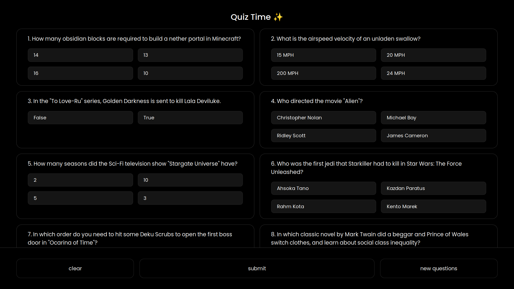
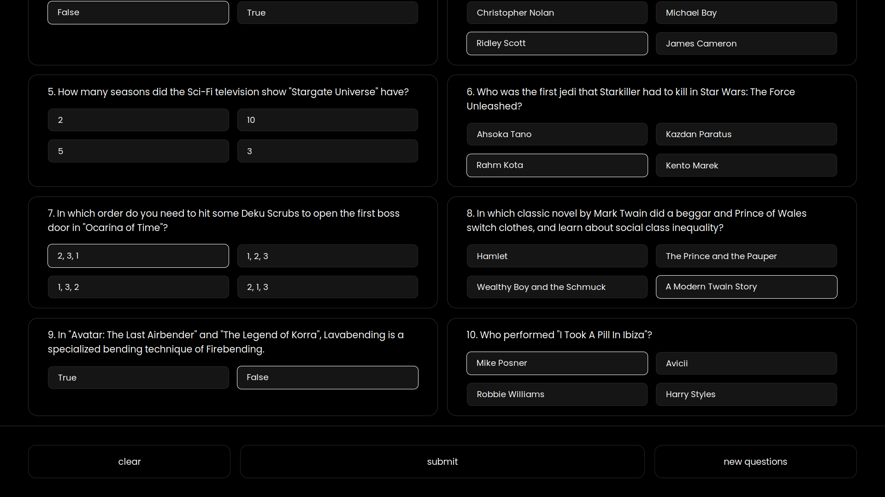
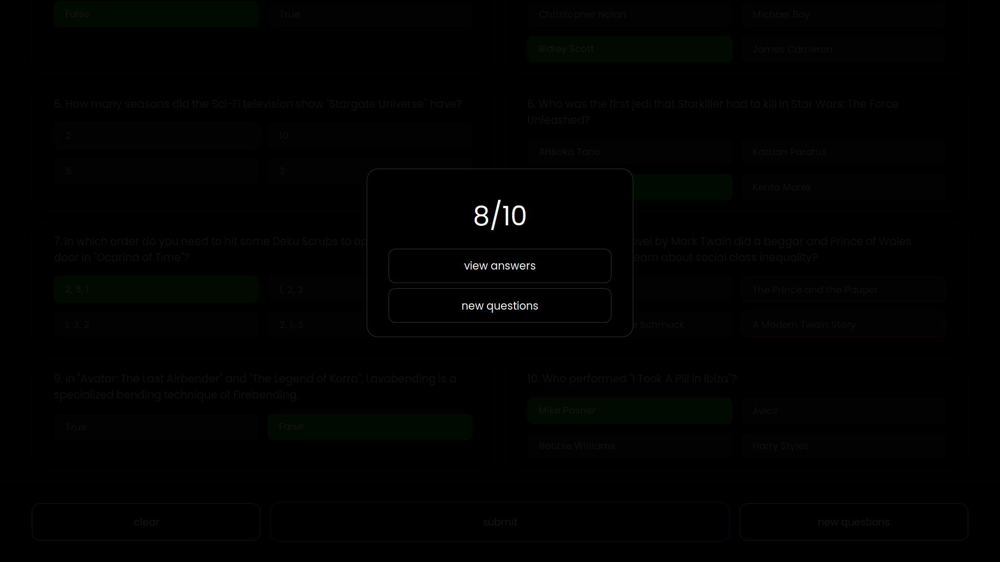
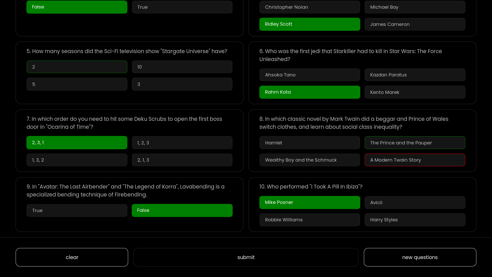
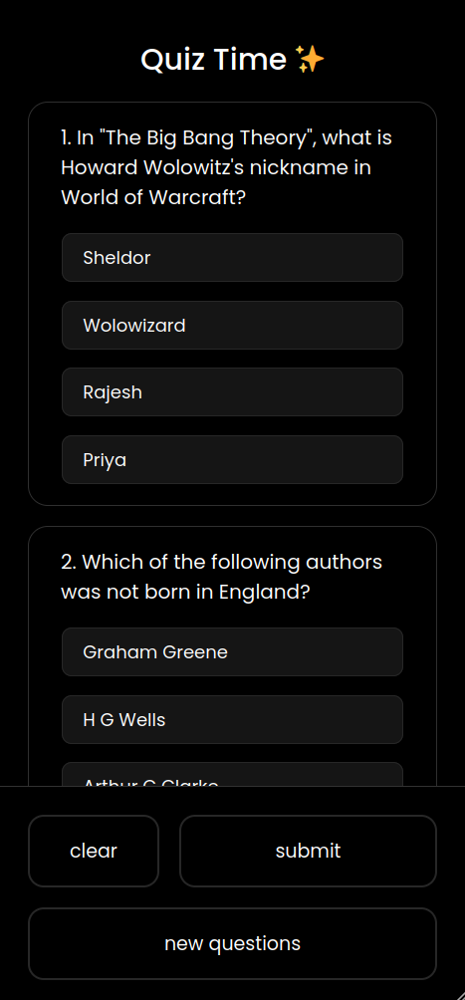
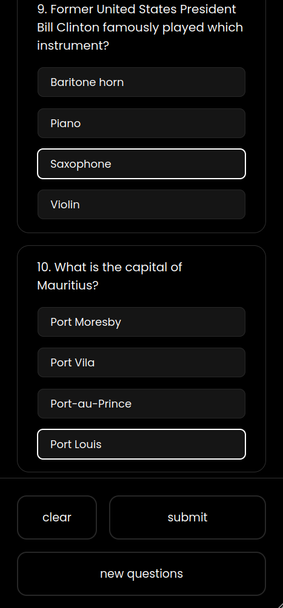
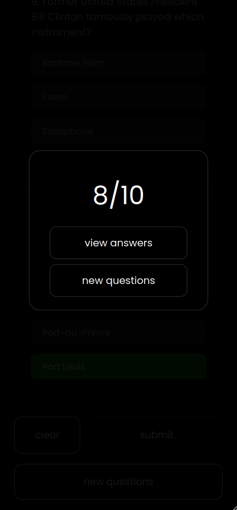
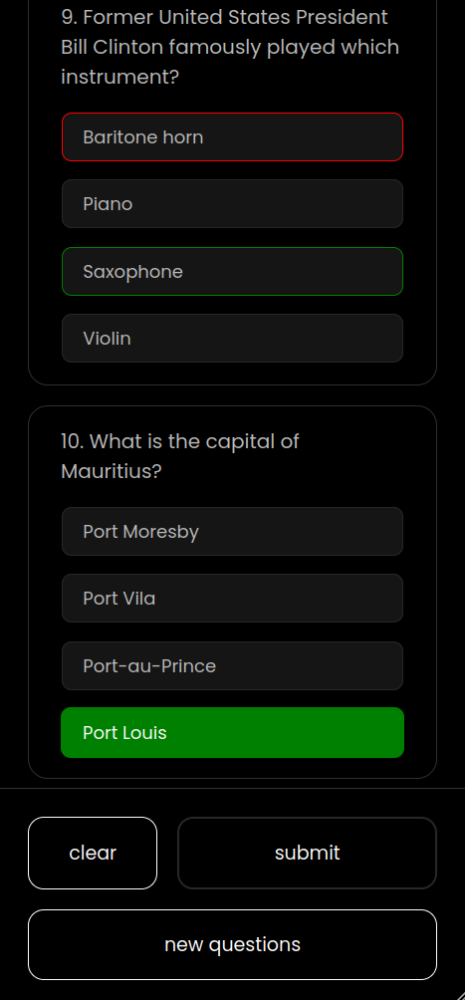

<h1 align="center">Quizer 🧠</h1>

Welcome to Quizer, the ultimate quiz application that challenges your knowledge and keeps you entertained! 🚀

🌐 Visit the Web App: <a href="https://imsreyas.github.io/Quizer/">Quizer</a>

## Features ✨

- Answer 10 thought-provoking questions in each round.
- Fetch new and exciting questions.
- Check your answers after submitting and track your score.
- Experience a sleek and user-friendly interface.

## How to Use 🤔

1. Open the Quizer app.
2. Answer the 10 questions presented in each round.
3. Fetch new questions to keep the challenge fresh.
4. Submit your answers and see your score.
5. Review your answers to learn and improve.

## Previews 📸

Here are some snapshots of Quizer in action:

- Home

- Selected

- Score

- View answers 

## Mobile Responsiveness 📱

Quizer is designed with mobile responsiveness in mind, ensuring a seamless and engaging experience across various devices.

Previews 
---

  
  
  
  
   
  
  
  
  

## Contributing 🤝

Want to contribute or report issues? Feel free to **create an issue** or submit a **pull request**. Your help is appreciated in making Quizer even better!

## Feedback 📣

Have suggestions or feedback? Reach out to me at sreyas.dev.contact@gmail.com. I'd love to hear from you!

---

Get ready to challenge your mind with Quizer! 🎉
